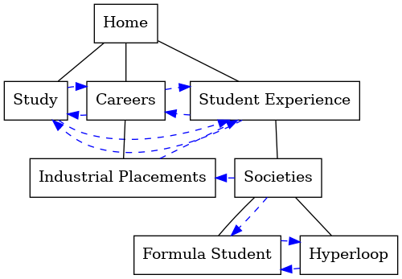

# link-mapper

Map hierarchy and links between web pages as specified in a yaml file



## Prerequisites

This script expects Python3 with `pyyaml` and `graphviz` installed. The script was developed with Anaconda python3 on Ubuntu linux.

To install the dependencies on linux
```
pip3 install pyyaml
pip2 install graphviz
```

## Usage

Edit the `definition.yaml` file to represent the pages

Check the file is formatted ok with `yamllint`:
````
yamllint definition.yaml

```

If there are no issues, then proceed, else stop and fix.

Run `python3 mapper.py` and inspect the output (a graphical illustration of the pages should appear, although there may be warnings if the yaml file is not complete, e.g. missing pages that are referred to in links, missing parents of pages etc).

The graph is saved both as `links.gv.pdf` and `links.gv.png` in the sub-directory `./output`

The parent-child hierarchy of the pages is shown with solid black lines. These parent-child relationships affect the "level" of the page, with `Home` at the top.

The page-to-page links are shown in dashed blue lines with arrowheads. These do not affect the level of the page in the graph, so that pages should be shown in a fairly sensible hierarchical tree.

## Yaml syntax

Yaml is fussy about spacing and formatting, but even so, is going to be easier to edit than trying to describe the page maps in an excel doc, for example.

Each page requires a `name` and `parent` field, but the `label` and `links` fields are optional.

If the label field is not present, then the name is put into title case, and underscores are replaced with spaces, and this becomes the label shown in the graph.

The name must be typed exactly in the following fields: `name`, `parent`, `links` or else there will be warnings. Capitalisation is ignored to make things a little easier. For example, a link of `Careers` to the page named `careers` will work, but `career` will NOT link to `careers` correctly because the letters are different. For this reason, it is recommened to use underscores where there are spaces in the `name` field, or to shorten names to avoid spaces altogether (specify a pretty name with spaces in it, in the `label` field in this case). Note that all interlinking is via the `name` field, NOT the `label` field - the label field is for display only.

example snippet describing the careers page:
```
  - name: careers
    parent: home
    links:
      - study
      - student_experience
```

Note: do not edit the home page entry. It does not need the parent field, and is the only page that is allowed to have no parent.

## Formatting


